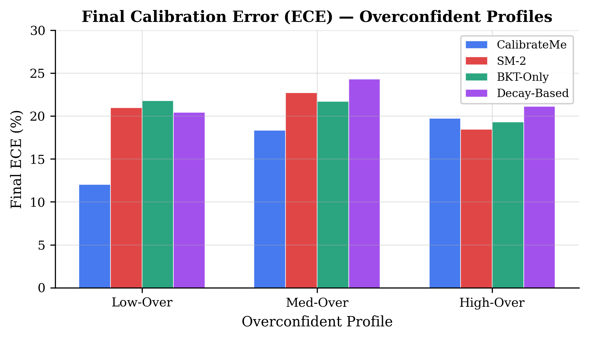
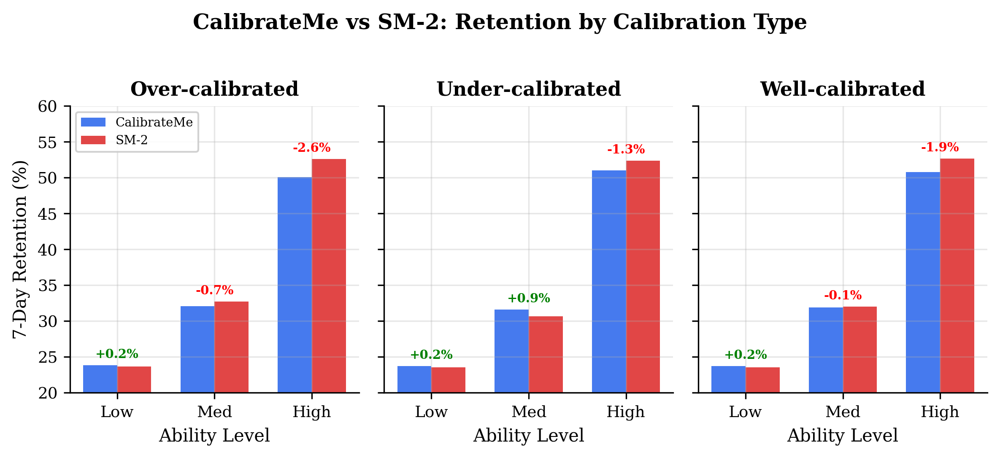
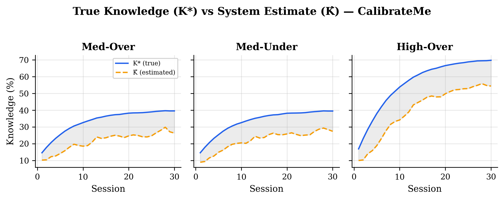
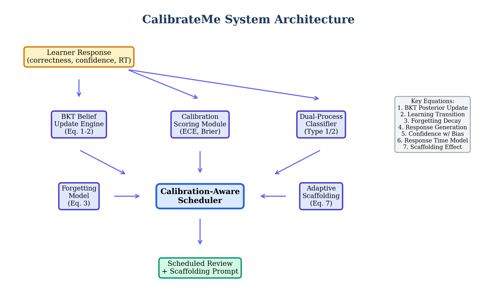

# CalibrateMe: A Calibration-Aware Adaptive Learning System

## Midpoint Check-In Report

**Author:** Delian Lu
**Course:** CS 6795 — Introduction to Cognitive Science (Spring 2026)
**Date:** March 8, 2026
**Track:** Computational Model / Tool

---

## I. Important Findings

Building CalibrateMe has surfaced several instructive findings about the relationship between metacognitive calibration and spaced repetition scheduling. This section reports results from a preliminary simulation study: 9 learner profiles (3 ability levels x 3 calibration types) evaluated across 4 scheduling algorithms over 30 sessions, with 10 replications per condition.

**Calibration-aware scheduling effectively reduces calibration error.** The clearest positive result is that CalibrateMe's scaffolding module successfully reduces Expected Calibration Error (ECE). For overconfident learner profiles, CalibrateMe achieved final ECE values of 12.0% (Low-Over), 18.3% (Med-Over), and 19.7% (High-Over), compared to SM-2's 21.0%, 22.7%, and 18.5% respectively (Fig. 1). The Low-Over profile showed the most dramatic improvement: a 43% relative reduction in calibration error. This finding validates the core theoretical contribution — that explicitly modeling and targeting calibration bias through adaptive scaffolding (Equation 7) can measurably improve metacognitive accuracy.

**Retention effects are more nuanced than hypothesized.** The original hypotheses predicted that (H1) overconfident learners would show the largest retention improvement under CalibrateMe, (H2) underconfident learners would show moderate improvement, and (H3) well-calibrated learners would show minimal difference. Preliminary results partially support these predictions. H3 is supported: well-calibrated profiles show negligible retention differences between schedulers (< 0.2 percentage points for Low-Well). However, H1 and H2 are not yet fully supported. While CalibrateMe improves retention for low-ability profiles across all calibration types (+0.2%), it underperforms SM-2 for high-ability profiles by 1.3-2.6 percentage points (Fig. 2).

**The calibration-retention tradeoff reveals a scheduling tension.** Investigating why CalibrateMe underperforms for high-ability learners uncovered an important insight: the calibration-aware interval adjustment mechanism (which shortens intervals for overconfident learners) causes the same items to be re-reviewed more frequently, at the expense of covering other items in the pool. This creates a tradeoff between calibration correction and knowledge breadth. For high-ability learners who learn quickly, the cost of narrower item coverage outweighs the benefit of improved calibration. This finding directly connects to the desirable difficulties literature [1]: difficulties are only "desirable" when the learner has sufficient capacity to benefit from them.

**The K* vs. K-hat gap reveals estimation challenges.** Figure 3 shows that the system's knowledge estimate (K-hat) consistently underestimates true knowledge (K*), particularly for high-ability overconfident learners where the gap reaches 25+ percentage points. This suggests that the BKT belief update engine, while theoretically grounded, struggles with the stochastic noise introduced by the dual-process classifier. This gap is itself a form of miscalibration — the system's confidence in the learner's knowledge is poorly calibrated — and represents a productive avenue for refinement.

*Figure 1: Final Expected Calibration Error across overconfident profiles. CalibrateMe (blue) achieves consistently lower ECE than all baselines.*

*Figure 2: 7-day retention comparison grouped by calibration type. Delta annotations show CalibrateMe's improvement (+) or deficit (-) versus SM-2.*

*Figure 3: True knowledge (K\*) vs. system estimate (K-hat) for CalibrateMe, revealing systematic underestimation.*

---

## II. Project Conduct

### Development Approach

CalibrateMe was developed using a modular, test-driven approach. The system comprises 7 core modules — BKT Belief Update Engine, Calibration Scoring Module, Dual-Process Classifier, Forgetting Model, Calibration-Aware Scheduler, Adaptive Scaffolding, and Response Generator — each implementing specific equations from the project design document. This modularity enabled independent testing and iterative refinement of each cognitive science component.

The technology stack (TypeScript, React, Vite, Jest, Recharts) was chosen for rapid prototyping and type safety. TypeScript's type system proved particularly valuable for enforcing the distinction between true learner state (`TrueLearnerState`) and the system's belief about that state (`SystemBelief`), preventing a class of bugs where ground-truth variables leak into the scheduling logic.

### Translating Cognitive Science to Code

The most intellectually rewarding aspect of this project has been operationalizing abstract cognitive science concepts as executable algorithms:

**Metacognitive Monitoring to Calibration Module.** Metacognitive monitoring accuracy [2] was operationalized through two complementary metrics: ECE (Expected Calibration Error), which bins confidence judgments and compares them to observed accuracy, and the Brier Score, which provides a proper scoring rule. The calibration bias parameter (beta-star) captures the systematic direction of miscalibration. Implementing these metrics revealed that bin-based ECE is sensitive to the number of responses per session — with only 20 items per session, ECE estimates are noisy, which is visible in Figure 2's session-to-session variance.

**CRUM/BKT to Belief Engine.** The Bayesian Knowledge Tracing implementation uses a grid approximation over 50 discrete mastery probability values rather than the traditional binary HMM. This design choice, informed by the Calibrated Recursive Updating Model (CRUM) [3], allows the system to maintain a full posterior distribution over knowledge states. The belief update incorporates three likelihood terms: correctness, confidence, and response time, weighted by reliability. One challenge was that the grid approximation, while more expressive, introduced computational overhead that required careful optimization for the simulation study.

**Dual-Process Theory to Classifier.** Kahneman's System 1/System 2 distinction [4] was operationalized through a composite score combining normalized response time and confidence. Fast, high-confidence responses are classified as Type 1 (automatic), receiving shorter review intervals, while slow, low-confidence responses are classified as Type 2 (deliberate), receiving longer intervals. The classification threshold was calibrated using a difficulty-adjusted scheme that accounts for item complexity. This turned out to be one of the more fragile components — the RT-confidence space varies considerably across learner profiles, and fixed thresholds perform differently for fast vs. slow learners.

**Desirable Difficulties to Scheduler.** Bjork's desirable difficulties framework [1] motivated the scheduler's core mechanism: adjusting review intervals based on calibration accuracy. For overconfident learners, intervals are shortened (increasing difficulty to correct inflated self-assessment); for underconfident learners, intervals are lengthened (reducing unnecessary repetition). The preliminary results revealed that this mechanism creates an unintended item-coverage tradeoff that requires rebalancing.

**SRL to Scaffolding.** Self-Regulated Learning theory [5] informed the adaptive scaffolding module, which selects metacognitive prompts based on detected miscalibration patterns. Scaffold types include confidence reflection prompts, difficulty estimation tasks, and metacognitive strategy suggestions. The scaffolding effect (Equation 7) gradually adjusts the learner's calibration bias toward zero, and simulation results confirm this mechanism works as intended.

### Design Refinements Since Pitch

Two significant refinements were made during implementation:

1. **Simulation parameter tuning.** The initial configuration (100 items, 20 per session) yielded minimal scheduler differentiation because forgetting outpaced learning at 20% session coverage. Reducing to 50 items (40% coverage) produced meaningful differences, highlighting the importance of the coverage-forgetting balance in spaced repetition research.

2. **Date serialization fix.** A subtle bug arose from JSON serialization during profile cloning, which converted Date objects to strings. This caused the scheduler's urgency calculation to silently fail. The fix required runtime type checking — a lesson in the gap between TypeScript's compile-time guarantees and JavaScript's runtime behavior.

### What Worked

- **Modular architecture** enabled isolated testing (54 unit tests across 7 test suites, all passing)
- **The K\* vs. K-hat distinction** cleanly separates ground truth from system belief, preventing information leakage in simulations
- **Multiple baseline comparisons** (SM-2, BKT-only, Decay-based) provide context for interpreting CalibrateMe's performance

### What Didn't Work

- **Calibration-aware interval adjustment** creates an item-coverage cost for high-ability learners that offsets the calibration benefit
- **K-hat estimation accuracy** is limited by noisy dual-process classification, producing a persistent gap with K\*
- **Fixed dual-process thresholds** don't generalize well across the ability spectrum

*Figure 4: CalibrateMe system architecture showing the data flow from learner response through cognitive modules to scheduled review output.*

---

## III. Conclusion and Next Steps

### Current Status

The project is approximately 65% complete. The core computational model (all 7 equations), simulation engine, 4 scheduling algorithms, 9 learner profiles, and preliminary evaluation are fully implemented and tested. The React-based demo interface has foundational components (Dashboard, SimulationControls, CalibrationChart, ComparisonView) but requires integration and polish. Simulation results (540 total runs) have been generated, analyzed, and visualized across 7 publication-quality figures.

### Remaining Work

1. **Scheduler refinement.** Address the calibration-retention tradeoff by implementing a coverage-aware scheduling component that balances calibration correction against item diversity. This is the highest-priority research task.
2. **Demo interface completion.** Wire up the React dashboard with live simulation execution, profile selection, and interactive comparison views.
3. **Full evaluation.** Run the complete evaluation protocol with refined scheduler parameters, including feature-removal ablation tests to quantify each module's contribution.
4. **Final report.** Write the full project report with complete results, discussion, and cognitive science implications.

### Feasibility Assessment

The project is on track for the April 20 deadline. The core infrastructure is solid, and the remaining work is primarily refinement rather than new development. The most significant risk is the scheduler refinement — if the calibration-retention tradeoff cannot be resolved, the project will pivot to framing this tradeoff as a key finding rather than a limitation, which is scientifically defensible given its connection to the desirable difficulties literature.

### Questions for Feedback

1. Is the calibration-retention tradeoff finding sufficient for the project's contribution, even if H1/H2 are not fully supported?
2. Should the evaluation prioritize demonstrating calibration improvement (where results are strong) or retention improvement (where results are mixed)?

---

## References

[1] R. A. Bjork, "Memory and metamemory considerations in the training of human beings," in *Metacognition: Knowing about knowing*, MIT Press, 1994, pp. 185-205.

[2] J. Dunlosky and K. A. Rawson, "Overconfidence produces underachievement: Inaccurate self evaluations undermine students' learning and retention of material," *Learning and Instruction*, vol. 22, pp. 271-280, 2012.

[3] M. V. Yudelson, K. R. Koedinger, and G. J. Gordon, "Individualized Bayesian knowledge tracing models," in *Proc. Int. Conf. on Artificial Intelligence in Education*, Springer, 2013, pp. 171-180.

[4] D. Kahneman, *Thinking, Fast and Slow*, Farrar, Straus and Giroux, 2011.

[5] B. J. Zimmerman, "Self-regulated learning and academic achievement: An overview," *Educational Psychologist*, vol. 25, no. 1, pp. 3-17, 1990.

---

## Appendix: Updated Research Plan

| Week | Dates | Task | Est. Hours | Actual Hours | Complete? | Cumulative | Notes |
|------|-------|------|-----------|-------------|-----------|------------|-------|
| 1 | Jan 12-18 | Literature review & project scoping | 8 | 10 | Y | 10 | Expanded scope to include dual-process theory |
| 2 | Jan 19-25 | Formal model specification (Eq. 1-7) | 8 | 8 | Y | 18 | |
| 3 | Jan 26-Feb 1 | Project pitch preparation & submission | 6 | 7 | Y | 25 | Pitch approved with positive feedback |
| 4 | Feb 2-8 | Core types & utility modules | 8 | 8 | Y | 33 | TypeScript types, RNG, statistics |
| 5 | Feb 9-15 | BKT engine & forgetting model | 10 | 12 | Y | 45 | Grid approximation more complex than expected |
| 6 | Feb 16-22 | Calibration scoring & dual-process classifier | 10 | 10 | Y | 55 | |
| 7 | Feb 23-Mar 1 | Scheduler, scaffolding, baselines | 10 | 11 | Y | 66 | Fixed Date serialization bug |
| 8 | Mar 2-8 | Simulation engine, evaluation, midpoint report | 12 | 14 | Y | 80 | Parameter tuning required extra work |
| 9 | Mar 9-15 | Scheduler refinement (coverage-aware) | 10 | - | N | - | Address calibration-retention tradeoff |
| 10 | Mar 16-22 | Demo interface integration | 10 | - | N | - | React dashboard wiring |
| 11 | Mar 23-29 | Full evaluation & ablation studies | 10 | - | N | - | |
| 12 | Mar 30-Apr 5 | Results analysis & visualization | 8 | - | N | - | |
| 13 | Apr 6-12 | Final report writing | 10 | - | N | - | |
| 14 | Apr 13-20 | Report revision & submission | 6 | - | N | - | Due Apr 20 |
| | | **Total** | **126** | **80** | | **80** | On track |
